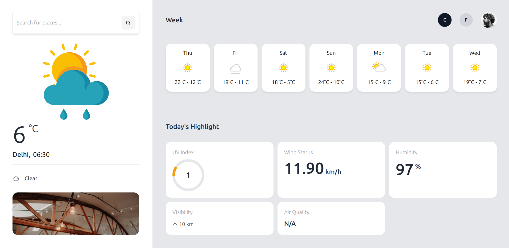

# Weather Dashboard Application

## Overview

The **Weather Dashboard Application** is a sleek and responsive web app built using **React.js** and **Tailwind CSS**. This app allows users to search for weather data in any city or detect their current location to display real-time weather conditions along with a 7-day forecast. It also provides detailed weather highlights like humidity, UV index, and wind status in an intuitive and visually appealing layout.



---

## Features

- **Current Weather**: Displays real-time weather information based on search input or current location.
- **7-Day Forecast**: Provides an extended weather forecast for the week ahead.
- **Location Search**: Allows users to search for any city or region worldwide.
- **Geolocation Support**: Automatically detects and shows the weather for the user's current location.
- **Weather Highlights**: Displays UV index, wind speed, humidity, visibility, and air quality.
- **Skeleton Loading**: Beautiful skeleton components to enhance the loading experience.
- **Responsive Design**: Fully responsive design using Tailwind CSS for seamless usage across devices.

---

## Technologies Used

- **React.js**: For building the dynamic UI components.
- **Tailwind CSS**: For crafting responsive and customizable styles.
- **Geolocation API**: To fetch the user's current location.
- **WeatherAPI**: For retrieving real-time weather and forecast data.
- **React Icons**: For various UI and weather-related icons.
- **CircularProgressbar**: For graphical representation of the UV index.
- **React Skeleton**: For smooth loading placeholders while data is being fetched.

---

## Getting Started

### Prerequisites

Ensure that the following are installed on your system:

- **Node.js** (version 14 or higher)
- **npm** or **yarn** for package management
- A **Weather API Key** from [WeatherAPI](https://www.weatherapi.com/)

### Installation

1. **Clone the repository**:

   ```bash
   git clone https://github.com/your-username/weather-dashboard.git
   ```

1. **Navigate to the project directory**:

   ```bash
   cd weather-dashboard
   ```

1. **Install dependencies**:

   ```bash
   npm install
   ```

1. **Create .env file**:

    In the project root, create a .env file and add your API key:

   ```bash
   VITE_API_URL = https://api.weatherapi.com/v1
   VITE_API_KEY = 
   ```

1. **Start the development server**:

   ```bash
   npm start
   ```
   

## Usage

1. Type a city name into the search input.
2. Press the search icon or hit "Enter" to fetch the weather data for that location.
3. View current weather details and the forecast for the next 7 days.

## API

This project uses the [WeatherAPI](https://www.weatherapi.com/) to fetch weather data. You will need an API key to make requests.

### How to Get an API Key:

1. Go to the [WeatherAPI website](https://www.weatherapi.com/).
2. Sign up for a free account.
3. After signing up, navigate to your dashboard to get your API key.
4. Add the API key to your `.env` file in the root of the project as follows:

```bash
REACT_APP_WEATHER_API_KEY=your_api_key_here
```

## Dependencies

This project relies on the following dependencies:

- **React**: A JavaScript library for building user interfaces.
- **Tailwind CSS**: A utility-first CSS framework for styling.
- **react-icons**: A popular set of icons for React applications.
- **react-circular-progressbar**: A component for creating circular progress indicators.

## Future Enhancements

- Add more detailed air quality data to enhance the user experience.
- Implement error handling and fallback UI for failed API requests to improve app reliability.
